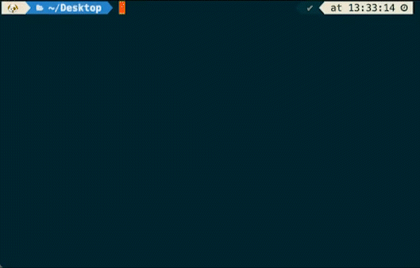

<h1>
  
  Skel
</h1>

[](https://github.com/mark-mcdermott/skel/actions/workflows/test.yml)

<p>
App scaffolding by typing in a tree-type list of the files and directories
</p>

<p align="center">
  
</p>

## About

Skel is a small bash utility for quickly scaffolding file structures from an indented tree.

```bash
./skel.sh <<EOF
.eslint.json
.gitignore
.prettierrc
electron-builder.yml
src
  main
    index.ts
  preload
    index.ts
  renderer
    App.tsx
    electron.d.ts
    index.html
    main.tsx
    styles
      global.css
    vite-env.d.ts
tsconfig.json
tsconfig.node.json
vite.config.ts
EOF
```

## Install

**Homebrew** (recommended):

```bash
brew tap mark-mcdermott/skel https://github.com/mark-mcdermott/skel
brew install skel
```

**Install script**:

```bash
git clone https://github.com/mark-mcdermott/skel.git
cd skel
./install.sh           # installs to /usr/local/bin/skel
./install.sh ~/.local/bin  # or a custom directory
```

**Make**:

```bash
git clone https://github.com/mark-mcdermott/skel.git
cd skel
make install           # installs to /usr/local/bin/skel
```

## Getting Started

Then try something like this:

```bash
./skel.sh <<EOF
file1.txt
directory1
  file2.txt
  directory2
    file3.txt
  file4.txt
file5.txt
EOF
```

Skel will create this file structure:

```text
├── directory1
│   ├── directory2
│   │   └── file3.txt
│   ├── file2.txt
│   └── file4.txt
├── file1.txt
└── file5.txt
```

You can also run skel interactively:

```bash
./skel.sh
```

Then type your structure and press Enter on a blank line to finish.

## Rules

- Use 2 spaces per indent level (or set a custom width with `-i N`)
- Tabs are not allowed
- Blank lines are not allowed in piped/heredoc input
- Duplicate paths are not allowed
- Directories can:
  - end with `/`
  - or be inferred automatically from indentation
- Empty directories must end with `/`
- Skel creates files relative to the current directory

## Tests

Run the test suite with:

```bash
./test.sh
```

## Why

Yesterday I searched for a way to scaffold a project from memory using syntax like the above and ChatGPT said there were not any clean bash solutions built for this. So I built my own. It also ended up being nice practice for thinking through a simple algorithm.

## How

I built v0.1.0 of skel by hand over two days, with help from ChatGPT on the bash syntaxes I couldn't remember.
For v0.2.0, including look-ahead, error checking, tests, built-in instructions, and more, I used ChatGPT extensively. It took me a few hours.
